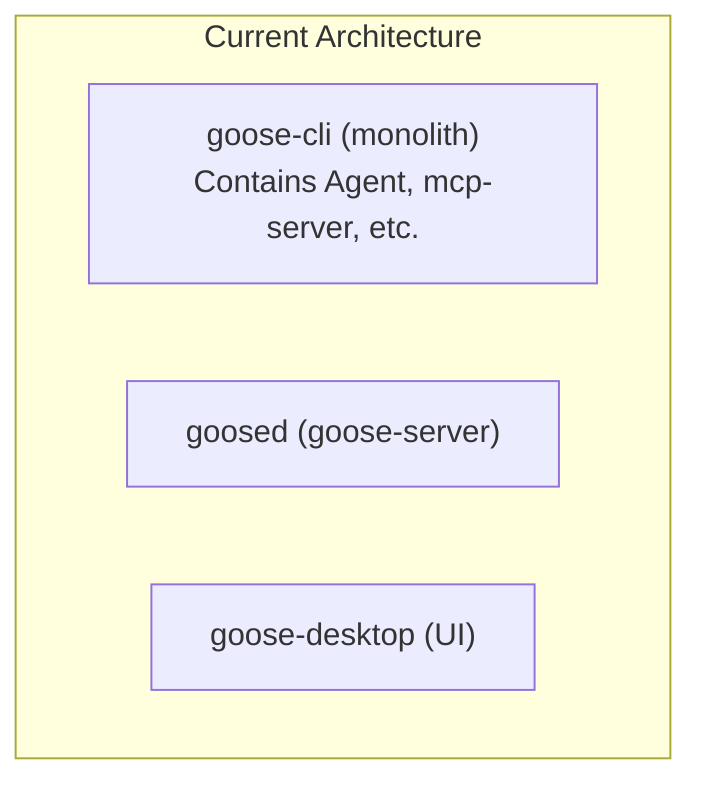
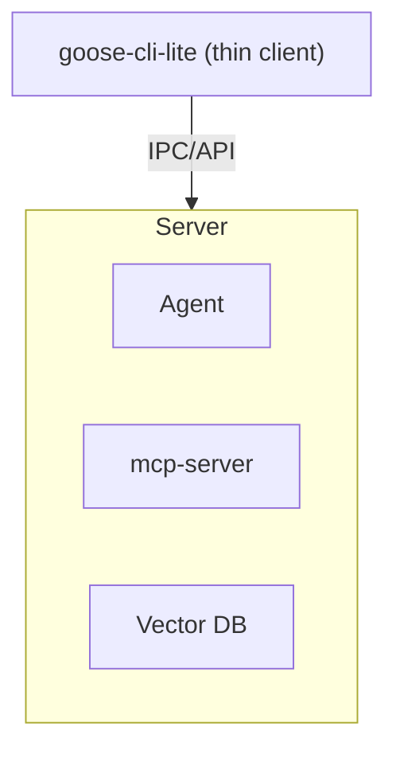
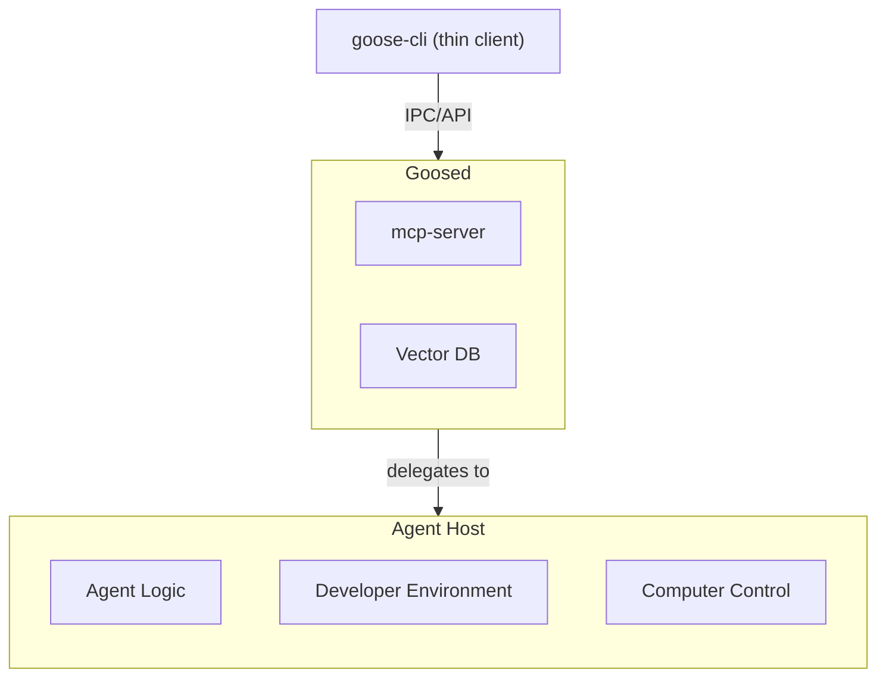

# Plan: Decoupling Goose CLI from Core Logic via GooseD

## 1. Goal

The primary goal of this plan is to significantly reduce the binary size of `goose-cli` by decoupling its core logic (including agent functionality, LLM interactions, and tool execution) into the `goosed` (goose-server) binary. This will enable `goose-cli` to act as a lightweight client, promoting code reuse and consistency between CLI and UI logic.

## 2. Current State

Currently, the `goose-cli` binary (`goose`) directly incorporates all necessary components, including the `goose` crate (which contains the `Agent` struct and its related logic), `mcp-server`, and other core functionalities. This results in a larger, monolithic binary.

A diagram of the current architecture:



## 3. Proposed Architecture

While the original `goose-cli` will eventually be refactored, this plan focuses on a Proof-of-Concept (PoC) using a new, lightweight client:

*   **`goose-cli-lite` (New Thin Client PoC)**: A new crate will be created to serve as a proof-of-concept for the lightweight command-line interface. It will be explicitly designed to:
    *   Parse user commands and arguments.
    *   Communicate with a running `goosed` instance.
    *   Display responses received from `goosed`.
*   **`goosed` (Backend Server)**: This existing binary, built from the `goose-server` crate, will host all the core logic, including:
    *   The `Agent` functionality (LLM interaction, tool dispatch, conversation management).
    *   `mcp-server` and related components.
    *   Any other heavy dependencies currently bundled with `goose-cli`.

Communication between `goose-cli-lite` and `goosed` will occur via a defined network protocol (e.g., HTTP/REST, WebSockets, gRPC), leveraging the existing server capabilities of `goosed`.

A diagram of this proposed architecture:



## 4. Key Changes and Steps

### 4.1. Create `goose-cli-lite` PoC Crate

*   **New Crate**: Create a new Rust crate `crates/goose-cli-lite` with a basic `Cargo.toml` and `src/main.rs`.
*   **Dependencies**: `goose-cli-lite` will only depend on necessary client-side libraries (e.g., `clap` for CLI parsing, `reqwest` for HTTP requests, `serde` for JSON serialization/deserialization).

### 4.2. Migrate Commands to `goose-cli-lite` (PoC Phase)

*   **Re-implement commands**: For each command being migrated, its logic will be re-implemented in `goose-cli-lite` to make API calls to `goosed` instead of directly using internal `goose` crate functionalities.
*   **`goosed` API utilization**: `goose-cli-lite` will consume the APIs exposed by `goosed` (e.g., `/info`, `/sessions/list`, `/sessions/remove`, `/sessions/export`).

### 4.3. Refactor Original `goose-cli` (Future Phase)

*   **Remove direct dependencies**: Once the `goose-cli-lite` PoC is successful and validated, the original `crates/goose-cli` will be refactored to remove its direct dependencies on `goose`, `goose-mcp`, and `mcp-server`.
*   **Adopt `goose-cli-lite` approach**: The original `goose-cli` will then adopt the thin client approach demonstrated by `goose-cli-lite`.

### 4.4. Consider `goosed` Process Management (Optional but Recommended)

*   **Automatic `goosed` startup**: Implement logic within `goose-cli-lite` (and eventually `goose-cli`) to automatically check for and, if necessary, start a `goosed` process in the background. This would mimic the behavior of `goose-desktop` and improve the user experience by removing the need for manual `goosed` startup.
*   **Port management**: Implement a mechanism for `goose-cli-lite` to discover or be configured with the port `goosed` is listening on.
*   **Lifecycle management**: Ensure `goose-cli-lite` can gracefully handle `goosed` shutdowns or restarts.

## 5. Benefits

*   **Clear Separation**: Explicitly defines `goose-cli-lite` as a thin client, making the architectural shift unambiguous.
*   **Non-Destructive PoC**: The original `goose-cli` remains untouched, reducing risk and allowing for easier comparison.
*   **Reduced `goose-cli` binary size**: This is the primary benefit, leading to faster downloads, smaller disk footprint, and potentially quicker startup times for the CLI itself.
*   **Independent scaling**: `goosed` can be scaled and deployed independently of `goose-cli`, allowing for more flexible resource allocation.
*   **Remote execution**: `goose-cli` can interact with a `goosed` instance running on a different machine or in a cloud environment, enabling powerful remote capabilities.
*   **Centralized logic**: Consolidating core logic in `goosed` simplifies maintenance and ensures consistent behavior across different clients (desktop, CLI).
*   **Code Reuse & Consistency**: Both CLI and UI will consume the same `goosed` API, leading to maximum code reuse and consistent behavior across platforms.

## 6. Challenges

*   **Inter-Process Communication (IPC) Overhead**: While generally minimal for most CLI operations, network communication introduces some latency compared to direct function calls.
*   **`goosed` Process Management**: Implementing robust automatic startup and management of the `goosed` process within `goose-cli` adds complexity. Users might also need to be aware of the `goosed` process running in the background.
*   **API Completeness**: Ensuring the `goosed` API fully supports all `goose-cli` functionalities without significant re-architecture of the server.

## 7. Progress Log

### Phase 1: Core Information & Configuration

*   **`goose info` command**:
    *   **Objective**: Implement the `goose info` command in `goose-cli-lite` to fetch and display core information from `goosed`.
    *   **Steps**:
        1.  **Create `goose-cli-lite` PoC Crate**:
            *   Create the directory `crates/goose-cli-lite`.
            *   Create a basic `Cargo.toml` within this directory, including `clap`, `reqwest`, `serde`, and `serde_json` as dependencies.
            *   Create an empty `src/main.rs` file.
        2.  **Implement `goose info` Command Logic**:
            *   Modify `src/main.rs` to parse the `info` command using `clap`.
            *   Make an HTTP GET request to the `/info` API endpoint of a running `goosed` instance (e.g., `http://localhost:8080/info`).
            *   Deserialize the JSON response.
            *   Print the extracted information to the console.
    *   **Status**: PoC completed in original `goose-cli`. Re-implementation in `goose-cli-lite` is in progress.

### Phase 2: Session Management

*   **`goose session list` command**: Migration completed in original `goose-cli`. Re-implemented in `goose-cli-lite` and verified.
*   **`goose session remove` command**: Migration completed in original `goose-cli`. Re-implemented in `goose-cli-lite` and verified.
*   **`goose session export` command**: Migration completed in original `goose-cli`. Re-implemented in `goose-cli-lite` and verified.

### Phase 3: Recipe Management

*   **`goose recipe list` command**: `goose-server` API implemented. Re-implemented in `goose-cli-lite` and verified.
*   **`goose recipe validate` command**: (Next)
*   **`goose recipe deeplink` command**: (Next)

### Phase 4: Core `goose run` and `goose session` (Interactive/Headless)

*   This phase involves the most complex migration, as it deals with the core `Agent` functionality and will likely require `goosed` to expose a streaming API (e.g., WebSockets) for interactive sessions.

## 8. Future Evolution: Decomposing `goosed`

Following the initial decoupling of `goose-cli`, a second phase of backend refactoring is planned. The `goosed` server will be decomposed into more specialized components:

*   **Agent Host**: A new, dedicated service that will contain the core `Agent` logic. This includes LLM interaction, tool dispatch, conversation management, and the ability to manage a **developer environment** and exercise **computer control**.
*   **`goosed` (Control & Data Plane)**: The existing `goosed` server will be streamlined to manage control functions (e.g., MCP) and handle the vector database.

This further modularization will allow for independent scaling and development of the agent and control/data components.

A diagram of this future architecture:



### Recent Changes

- **Added `utils` route:** Integrated the `utils` module's routes into the main server configuration.
- **Refactored `get_info_handler`:**
    - Moved `InfoResponse` struct and `get_info_handler` function from `crates/goose-server/src/handlers.rs` to `crates/goose-server/src/routes/utils.rs`.
    - Updated `crates/goose-server/src/routes/mod.rs` to import `get_info_handler` from `utils`.
    - Deleted the now-empty `crates/goose-server/src/handlers.rs` file.
- **Created dedicated `info` module:**
    - Created a new file `crates/goose-server/src/routes/info.rs`.
    - Moved `InfoResponse` struct and `get_info_handler` function from `crates/goose-server/src/routes/utils.rs` to `crates/goose-server/src/routes/info.rs`.
    - Updated `crates/goose-server/src/routes/mod.rs` to include `pub mod info;` and to merge `info::routes()`.
    - Cleaned up `crates/goose-server/src/routes/utils.rs` by removing the moved code.

## 9. Default `goose-cli-lite` Behavior

When `goose-cli-lite` is run without any specific commands, it defaults to starting an interactive session and outputs the following:

```
starting session | provider: gemini-cli model: gemini-2.5-flash
    logging to /data/data/com.termux/files/home/.local/share/goose/sessions/20250813_134303.jsonl
    working directory: /data/data/com.termux/files/home

Goose is running! Enter your instructions, or try asking what goose can do.

Context: ○○○○○○○○○○ 0% (0/1000000 tokens)
( O)> Press Enter to send, Ctrl-J for new line
```